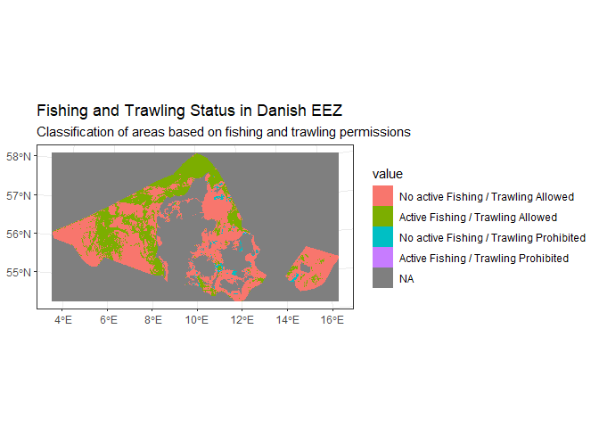
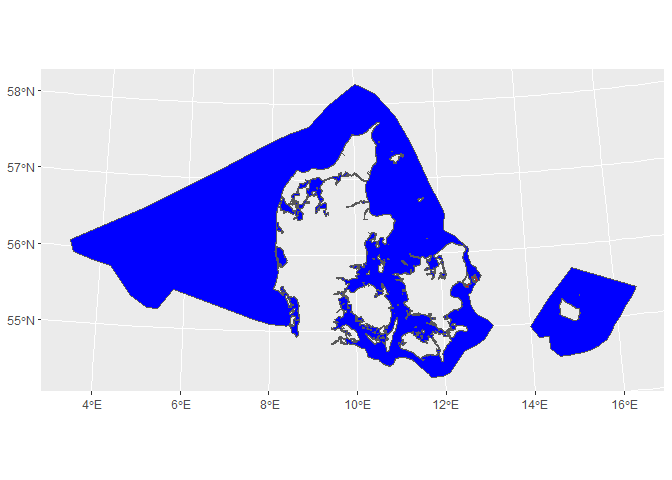

BDR Analysis for Sea Area Protection
================

This repository provides a geospatial analysis of protection schemes
within the Danish Exclusive Economic Zone. The analysis integrates
various protection scheme layers, assesses trawling and fishing impacts,
and classifies areas based on protection status and legal requirements.

## Load Required Libraries

First we load the required packages

``` r
library(terra)
library(ggplot2)
library(tidyterra)
library(purrr)
library(magrittr)
```

## Load Protection Schemes

The main protection schemes are loaded and combined into a single raster
stack, including:

- Natura 2000 areas
- Marine strategy areas (Havstrategi)
- Wildlife reserves
- IUCN-registered protected areas

Read the protection schemes

``` r
protection_schemes <- c("Data/natura2000_denmark_sea.tif", 
            "Data/havstrategistandard_denmark_sea.tif", 
            "Data/vildtreservater_denmark_sea.tif",
            "Data/IUCN_fredninger_denmark_sea.tif") |> 
  purrr::map(terra::rast) |> 
  purrr::reduce(c) |> 
  magrittr::set_names(c("Natura2000","Havstrategi_standard", "vildtreservater", "IUCN_Fredninger"))
```

## Define Denmark’s Exclusive Economic Zone (EEZ) Boundary and Area

The EEZ boundary of Denmark is loaded and its area calculated in square
kilometers. This boundary is used to standardize the study area.

``` r
# Load Denmark's EEZ boundary
DenmarkEEZBoundary <- terra::vect("Data/EEZ.shp")

# Calculate the total area of the EEZ in square kilometers
Area_DK_KM_Sea <- terra::expanse(DenmarkEEZBoundary, unit = "km")
```

## Define the Sea Template and Mask with EEZ Boundary

We create a sea template raster, masking it to the Denmark EEZ boundary.
This template will serve as a reference for subsequent spatial
operations.

``` r
# Load and initialize sea template raster
SeaTemplate <- terra::rast("Data/sea_template.tif")
values(SeaTemplate) <- 0

# Apply mask using the EEZ boundary to standardize the study area
SeaTemplate <- SeaTemplate |> terra::mask(DenmarkEEZBoundary, inverse = FALSE)
```

## read in Protected areas

We read in areas that are considered to be protected

``` r
protected_areas_sea <- terra::rast("Data/protected_areas_sea.tif")
```

## read in Fishing and Trawling Status

In addition to protected areas, we also have a layer representing the
fishing and trawling status in different zones of the Danish EEZ. This
fishing_trawling_status layer categorizes areas based on whether active
fishing is permitted and whether trawling is allowed. Here are the
categories in this layer:

- No active Fishing / Trawling Allowed: No active fishing occurs, but
  trawling is legally permitted.
- Active Fishing / Trawling Allowed: Active fishing ocurrs and trawling
  is legally permitted.
- No active Fishing / Trawling Prohibited: No active fishing, and
  trawling is legally prohibited.
- Active Fishing / Trawling Prohibited: Active fishing occurs, but
  trawling is legally prohibited.

These categories allow us to understand both the legal and active status
of fishing and trawling activities within the EEZ, which is crucial for
identifying areas under different management regulations.

``` r
fishing_trawling_status <- terra::rast("Data/fishing_trawling_status.tif")

fishing_trawling_numeric <- as.numeric(fishing_trawling_status)
```

We visualize the fishing_trawling_status layer to get an overview of
where active fishing and trawling are permitted or restricted within the
study area. Each color in the map represents one of the four categories
defined above.

<!-- -->

## Goal

Final should map should have Protected areas, requires individual
assessment, insufficient legal protection, active fishing with bottom
trawl, no protection.

- Protected areas are PA
- require individual assessment is only IUCN fredninger
- insufficient legal protection (PSbinary substract Protecta and
  individual assesment, and then find which of this is not trawlfri, no
  active fishing)
- active fishing with no trawl

# Updating Protection Schemes

To ensure the accuracy of our dataset, we incorporated recent updates to
two protection schemes: Havstrategi and Natura 2000. Specifically, we
added the Oeresund region to the Havstrategi omrade and included new
designated areas in the Natura 2000 layer.

## Adding Oersund to Havstrategi omrade

In this update, the Øresund region was added to the Havstrategi omrade,
reflecting the latest boundaries for marine strategy areas.

``` r
Havstrategi <- terra::rast("Data/havstrategistandard_denmark_sea.tif") |> as.polygons() |> terra::disagg()

Oeresund <- terra::vect("Data/Eksisterende_beskyttet_område_i_¥resund.shp") |> terra::project(Havstrategi)

TotalHavstrategi <- terra::union(Havstrategi, Oeresund)
```

In the code above:

- Havstrategi: Loads the existing marine strategy areas.
- Oeresund: Loads and reprojects the Øresund region to align with the
  Havstrategi layer.
- TotalHavstrategi: Combines the two areas into a single layer,
  reflecting the full, updated marine strategy zone.

This process ensures that Oeresund is fully integrated into the
Havstrategi omrade for subsequent analyses.

## Adding New Natura 2000 area

To keep the Natura 2000 layer up-to-date, we also incorporated a newly
designated Natura 2000 area located in the Tyske Bugt region. This
addition aligns our dataset with the latest conservation boundaries.

``` r
# Load the existing Natura 2000 reserves
N2000_reserves <- protection_schemes["Natura2000"]

# Convert the Natura 2000 raster to polygons for editing and disaggregate
N2000_reserves_sf <- N2000_reserves |> 
  as.polygons() |> 
  terra::disagg()

# Load and reproject the new Natura 2000 area in Tyske Bugt to match the existing reserves
AddToN2000 <- terra::vect("O:/Nat_BDR-data/Arealanalyse/2023/RAW/Fuglebeskyttelsesområde_i_Tyske_Bugt/Fuglebeskyttelsesområde_i_Tyske_Bugt.shp") |> 
  terra::project(terra::crs(N2000_reserves_sf))

# Combine the existing Natura 2000 reserves with the new Tyske Bugt area
TotalN2000 <- terra::union(N2000_reserves_sf, AddToN2000)
```

### Explanation of Steps

- N2000_reserves: Loads the current Natura 2000 raster layer from
  protection_schemes.

- N2000_reserves_sf: Converts the Natura 2000 raster to a polygon format
  for merging and disaggregates any connected areas for more precise
  boundary handling.

- AddToN2000: Loads the new Natura 2000 area in Tyske Bugt, reprojecting
  it to ensure alignment with the existing Natura 2000 layer.

- TotalN2000: Combines the updated Natura 2000 polygons with the new
  addition in Tyske Bugt, resulting in an expanded Natura 2000 layer.

This update ensures that the Natura 2000 layer reflects all recent
additions and is fully prepared for subsequent spatial analyses.

## Build ps binary

Build binary protection schemes

``` r
PSbinary <- SeaTemplate

# havstrategi add Oeresund

# natura2000 add new bird area
#


N2000_havstrategi <- terra::union(TotalHavstrategi, TotalN2000)


## Add Wildife reserves and IUCN fredninger

Reserves <- protection_schemes[[3]] |> 
  as.polygons() |> 
  terra::disagg()

Reserves <- Reserves |> terra::project(terra::crs(N2000_havstrategi))

writeVector(Reserves, "Reserves.shp", overwrite = T)

N2000_havstrategi_reserves <- terra::union(N2000_havstrategi, Reserves)

IUCN <- protection_schemes[[4]] |> 
  as.polygons() |> 
  terra::disagg()

IUCN <- IUCN |> terra::project(terra::crs(N2000_havstrategi))

N2000_havstrategi_reserves_IUCN <- terra::union(N2000_havstrategi_reserves, IUCN)

RasterizedPS <- N2000_havstrategi_reserves_IUCN |> 
  terra::project(terra::crs(PSbinary)) |> 
  terra::rasterize(PSbinary, field = 1, background = 0)

SpeciesPoolR::write_cog(RasterizedPS, "PSbinary.tif")
```

### First we add protected areas

``` r
Categories <- SeaTemplate
Categories <- terra::ifel(protected_areas_sea == 1, 1, SeaTemplate)
```

Then we add areas that are fished

``` r
PSbinary <- terra::rast("PSbinary.tif")
Categories <- terra::ifel(Categories == 0 & fishing_trawling_numeric %in% c(2,4) & PSbinary == 1, 4, Categories)
```

Then we add requires individual assesment (check if there is trawlin
here)

RIA = IUCN - ActiveTrawling

``` r
IUCN <- terra::rast("O:/Nat_BDR-data/Arealanalyse/2023/CLEAN/Rast_Fredninger_Croped_Sea.tif") |> as.numeric()

Categories <- terra::ifel(Categories == 0 & IUCN == 0, 2, Categories)
```

After that we include insufficient legal protection

ILP = Protection Schemes - PA - RIA - AciveFishingArea

``` r
Categories <- terra::ifel(PSbinary == 1 & Categories == 0, 3, Categories)
```

## Final category

``` r
Categories <- terra::rast("FourCats.tif") |> 
  as.numeric()

LVLS <- data.frame(Level = c(0:4), Category = c("Other", "Protected", "Requires individual assesment", "insufficient legal protection", "Active fishing"))

Categories2 <- Categories
levels(Categories2) <- LVLS
SpeciesPoolR::write_cog(Categories2, "SeaAllCats.tif")
```

Areas

``` r
Areas <- terra::freq(Categories2)

Areas2 <- Areas |> 
  dplyr::mutate(Km2 = (count*100)/1000000, percentage = (Km2/Area_DK_KM_Sea)*100) |> 
  dplyr::select(-layer, -count)
```

# Next steps

## Read in Trawlfri and make it a polygon

``` r
Trawlfri <- terra::rast("O:/Nat_Sustain-proj/_user/derekCorcoran_au687614/biodiversitetsradet.github.io/sea_area_analyses/Trawlfri.tif") |> as.polygons() |> terra::disagg()
```

- Trawlfri layer Check intercept with updated layers (Natura2000,
  Havstrategi, IUCN Fredninger, Wildreservater)

## Check intersection with havstrategi omrade

``` r
Intersection_havstrategi_Trawlfri <- terra::intersect(TotalHavstrategi,Trawlfri)

writeVector(Intersection_havstrategi_Trawlfri, "Intersection_havstrategi_Trawlfri.shp")

Intersection_havstrategi_Trawlfri_area <- terra::expanse(Intersection_havstrategi_Trawlfri, unit = "km")
```

The total area of the intersection between trawlfri areas and
havstrategi omrade is 451.51 square kilometers, the area can be seen in
the following plot in red

<!-- -->

## Check intersection with Natura 2000

``` r
Intersection_Natura2000_Trawlfri <- terra::intersect(TotalN2000,Trawlfri)

writeVector(Intersection_Natura2000_Trawlfri, "Intersection_Natura2000_Trawlfri.shp")

Intersection_Natura2000_Trawlfri_area <- terra::expanse(Intersection_Natura2000_Trawlfri, unit = "km")
```

The total area of the intersection between trawlfri areas and Natura
2000 is 430.77 square kilometers, the area can be seen in the following
plot in red

``` r
ggplot() + geom_spatvector(data = DenmarkEEZBoundary, fill = "blue") + geom_spatvector(data = Intersection_Natura2000_Trawlfri, fill = "red")
```

<!-- -->

## Check intersection with wildife Reserves

``` r
Reserves <- terra::vect("Reserves.shp")

Intersection_Reserves_Trawlfri <- terra::intersect(Reserves,Trawlfri)

writeVector(Intersection_Reserves_Trawlfri, "Intersection_Reserves_Trawlfri.shp")

Intersection_Reserves_Trawlfri_area <- terra::expanse(Intersection_Reserves_Trawlfri, unit = "km")
```

The total area of the intersection between trawlfri areas and Wildlife
reserves is 189.06 square kilometers, the area can be seen in the
following plot in red

``` r
ggplot() + geom_spatvector(data = DenmarkEEZBoundary, fill = "blue") + geom_spatvector(data = Intersection_Reserves_Trawlfri, fill = "red")
```

<!-- -->

## 

## Check intersection with IUCN Fredninger

``` r
IUCN <- as.polygons(IUCN) |> terra::disagg()
Intersection_IUCN_Trawlfri <- terra::intersect(IUCN,Trawlfri)

writeVector(Intersection_IUCN_Trawlfri, "Intersection_IUCN_Trawlfri.shp")

Intersection_IUCN_Trawlfri_area <- terra::expanse(Intersection_IUCN_Trawlfri, unit = "km")
```

The total area of the intersection between trawlfri areas and IUCN
Fredninger is 89.62 square kilometers, the area can be seen in the
following plot in red

``` r
ggplot() + geom_spatvector(data = DenmarkEEZBoundary, fill = "blue") + geom_spatvector(data = Intersection_IUCN_Trawlfri, fill = "red")
```

<!-- -->
