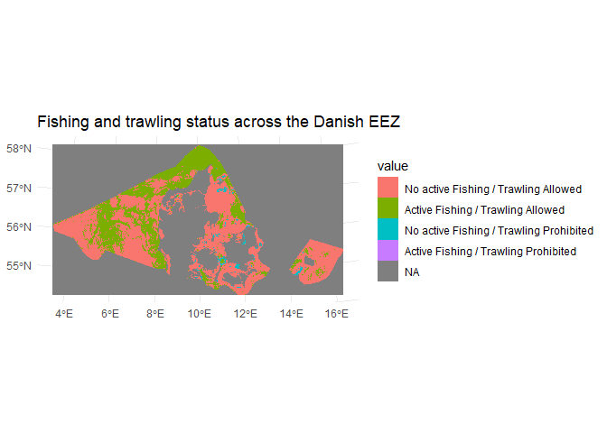
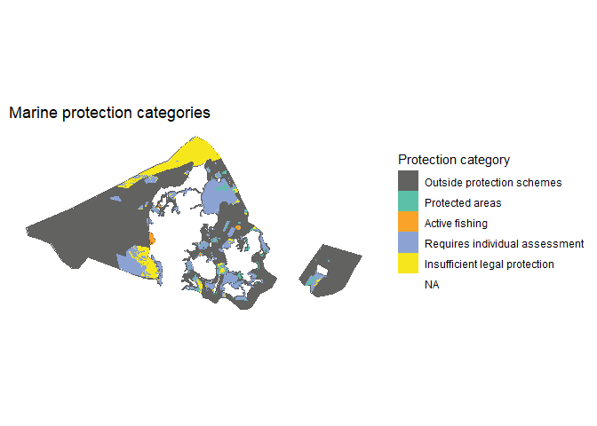

Identifying the Marine Conservation Gaps: Workflow and geospatial
outcome for the Danish contribution to the 30% Target
================

This repository documents the data, processing steps and R code used to
reproduce the **marine analyses**, **Fig. 2**, and **Table S3** in the
manuscript *Identifying Conservation Gaps: A Framework for Evaluating
National Contributions to the 30x30 Target*.

The purpose of this repository is to provide a fully transparent and
reproducible workflow for assessing Denmark’s marine contribution to the
global **30% protection target**, using spatially explicit criteria
aligned with international guidance and the conceptual framework
developed in the manuscript.

Fig. 2 shows how Denmark’s marine areas within the Danish Exclusive
Economic Zone (EEZ) contribute to the **30% protection target**,
distinguishing between:

- areas that fully qualify as contributing protected areas,
- areas requiring individual assessment,
- areas with insufficient legal protection,
- areas where biodiversity is compromised by active fishing with
  bottom‑towed gear, and
- areas outside protection schemes.

The classification mirrors the terrestrial workflow used for Fig. 1 of
the manuscript and follows the same conceptual framework based on
criteria C1–C5 for protected areas (Table 1 in the manuscript). The
objective is to ensure that terrestrial and marine contributions to the
30% target are evaluated using consistent ecological and legal
definitions.

This README focuses on the spatial data processing steps used to derive
the marine protection map and summary statistics for **Fig. 2** and
**Table S3** in the supplementary material. All intermediate layers and
outputs required to reproduce the analyses are included in this
repository.

# Software, packages and helper functions

All spatial analyses were carried out in R using the same core packages
as the terrestrial workflow to ensure methodological consistency across
realms:

- [`terra`](https://cran.r-project.org/package=terra) for raster and
  vector processing
- [`ggplot2`](https://cran.r-project.org/package=ggplot2) and
  [`tidyterra`](https://cran.r-project.org/package=tidyterra) for
  visualisation
- [`dplyr`](https://cran.r-project.org/package=dplyr) and
  [`purrr`](https://cran.r-project.org/package=purrr) for data
  manipulation and iteration
- [`magrittr`](https://cran.r-project.org/package=magrittr) for
  pipe‑based workflows

Using identical tooling across terrestrial and marine analyses ensures
that differences between realms arise from ecological and legal
conditions rather than computational methods.

We also define a helper function:

- `write_cog()` to save a `SpatRaster` as a Cloud Optimised GeoTIFF
  (COG) for reproducible sharing and archiving.

``` r
library(terra)
library(ggplot2)
library(tidyterra)
library(dplyr)
library(purrr)
library(magrittr)
```

``` r
write_cog <- function(x, filename) {
  terra::writeRaster(
    x = x,
    filename = filename,
    overwrite = TRUE,
    gdal = c("COMPRESS=DEFLATE", "TFW=YES", "of=COG")
  )
}
```

# Spatial boundary and template

## Danish Exclusive Economic Zone (EEZ)

The Danish EEZ boundary defines the marine analysis domain and is used
to calculate total marine area and category proportions. All area
statistics reported in the manuscript refer to this spatial extent.

``` r
DenmarkEEZBoundary <- terra::vect("Data/EEZ.shp")
Area_DK_KM_Sea <- terra::expanse(DenmarkEEZBoundary, unit = "km")
```

The total Danish marine area considered in the analysis is 1.0548258^{5}
km².

## Sea template

All rasters are aligned to a common marine template defining the spatial
resolution, extent and coordinate reference system. This mirrors the
template‑based workflow used in the terrestrial analysis and ensures
that all layers are spatially comparable.

``` r
SeaTemplate <- terra::rast("Data/sea_template.tif")
values(SeaTemplate) <- 0
SeaTemplate <- SeaTemplate |> terra::mask(DenmarkEEZBoundary)
```

# Marine protection schemes

The marine assessment integrates all spatially mapped protection schemes
currently recognised within Danish marine waters. These include:

- Natura 2000 (marine component)
- Marine Strategy Areas (Havstrategi)
- Wildlife reserves
- IUCN‑registered conservation orders (fredninger)

These schemes differ substantially in legal strength, management
requirements and ecological scope. Some meet the criteria for fully
contributing protected areas (C1–C5), while others allow activities that
may compromise biodiversity or lack sufficient information to evaluate
effectiveness.

``` r
protection_schemes <- c(
  "Data/natura2000_denmark_sea.tif",
  "Data/havstrategistandard_denmark_sea.tif",
  "Data/vildtreservater_denmark_sea.tif",
  "Data/IUCN_fredninger_denmark_sea.tif"
) |>
  purrr::map(terra::rast) |>
  purrr::reduce(c) |>
  magrittr::set_names(c(
    "Natura2000",
    "Havstrategi_standard",
    "Wildlife_reserves",
    "IUCN_Fredninger"
  ))
```

# Fishing pressure and biodiversity impact

As in the terrestrial analysis where infrastructure and intensive land
use override protection status, **active fishing pressure** is treated
as a biodiversity‑compromising activity in the marine environment.

Bottom‑towed fishing gear and intensive fishing can significantly reduce
ecological integrity even inside designated protected areas. Therefore,
areas where such activities occur are not considered to fully contribute
to the 30% target, even if they fall within formal protection schemes.

The fishing layer classifies areas into four categories reflecting both
legal permission and observed activity:

1.  No active fishing / trawling allowed
2.  Active fishing / trawling allowed
3.  No active fishing / trawling prohibited
4.  Active fishing / trawling prohibited

``` r
fishing_trawling_status <- terra::rast("Data/fishing_trawling_status.tif")
fishing_trawling_numeric <- as.numeric(fishing_trawling_status)
```

<!-- -->

This layer is used to identify areas where ongoing fishing activity
compromises biodiversity outcomes and therefore limits effective
protection.

# Updating protection layers

To ensure consistency with the manuscript analyses, spatial updates were
incorporated for two protection schemes.

## Integration of Øresund into Havstrategi

``` r
Havstrategi <- terra::rast("Data/havstrategistandard_denmark_sea.tif") |>
  as.polygons() |>
  terra::disagg()

Oeresund <- terra::vect("Data/Eksisterende_beskyttet_område_i_¥resund.shp") |>
  terra::project(Havstrategi)

TotalHavstrategi <- terra::union(Havstrategi, Oeresund)

TotalHavstrategiRast <- terra::rasterize(TotalHavstrategi, SeaTemplate)

write_cog(TotalHavstrategiRast, "FinalLayers/TotalHavstrategi.tif")
```

## Addition of new Natura 2000 area

``` r
N2000_reserves <- protection_schemes["Natura2000"]

N2000_reserves_sf <- N2000_reserves |>
  as.polygons() |>
  terra::disagg()

AddToN2000 <- terra::vect("Data/Fuglebeskyttelsesområde_i_Tyske_Bugt.shp") |>
  terra::project(terra::crs(N2000_reserves_sf))

TotalN2000 <- terra::union(N2000_reserves_sf, AddToN2000)

TotalN2000Rast <- terra::rasterize(TotalN2000, SeaTemplate)

write_cog(TotalN2000Rast, "FinalLayers/TotalN2000.tif")
```

These updates ensure that the spatial layers used in the analysis
reflect the most recent protection designations included in the
manuscript.

# Binary marine protection layer

All marine protection schemes are merged into a single binary raster
indicating whether a pixel is covered by at least one protection
designation. This mirrors the terrestrial “Subclasses” layer used to
identify areas inside protection schemes.

``` r
PSbinary <- SeaTemplate

N2000_havstrategi <- terra::union(TotalHavstrategi, TotalN2000)

Reserves <- protection_schemes[[3]] |>
  as.polygons() |>
  terra::disagg() |>
  terra::project(terra::crs(N2000_havstrategi))

IUCN <- protection_schemes[[4]] |>
  as.polygons() |>
  terra::disagg() |>
  terra::project(terra::crs(N2000_havstrategi))

AllMarineProtection <- terra::union(N2000_havstrategi, Reserves) |>
  terra::union(IUCN)

RasterizedPS <- AllMarineProtection |>
  terra::project(terra::crs(PSbinary)) |>
  terra::rasterize(PSbinary, field = 1, background = 0)

write_cog(RasterizedPS, "FinalLayers/PSbinary.tif")
```

# Marine protection categories and prioritisation

As in the terrestrial workflow, protection categories are not mutually
exclusive: a given pixel may belong to multiple protection schemes and
may also experience fishing pressure.

To produce the harmonised marine map (Fig. 2), each pixel is assigned to
a single category following a fixed priority order:

1.  Protected areas (fully contributing to the 30% target)
2.  Areas compromised by active fishing
3.  Insufficient legal protection
4.  Requires individual assessment
5.  Outside protection schemes

This prioritisation ensures conceptual and methodological consistency
between terrestrial and marine analyses.

## Protected areas (fully contributing)

Fully contributing marine protected areas are those where biodiversity
protection is effective and long‑term and where damaging activities such
as bottom‑towed fishing are absent.

In the Danish marine assessment this primarily includes reef areas
within Natura 2000 that are effectively protected from bottom‑towed
fishing.

``` r
Categories <- SeaTemplate
Categories <- terra::ifel(
  Natura_2000_reef_existent_Protected == 1,
  1,
  Categories
)
```

## Areas compromised by active fishing

Areas within protection schemes where active fishing occurs are
classified as compromised. These areas are treated analogously to
production landscapes in the terrestrial analysis, where ongoing
intensive land use overrides protection status.

``` r
Categories <- terra::ifel(
  Categories == 0 &
  fishing_trawling_numeric %in% c(2,4) &
  RasterizedPS == 1,
  2,
  Categories
)
```

## Requires individual assessment

Some protection schemes lack sufficient spatial or legal information to
determine whether criteria C1–C5 are fully met. These areas are flagged
as requiring individual assessment and may contribute to protection
targets depending on site‑specific management and legal provisions.

``` r
IUCN_layer <- protection_schemes[[4]]

Categories <- terra::ifel(
  Categories == 0 & !is.na(IUCN_layer),
  3,
  Categories
)
```

## Insufficient legal protection

Areas within protection schemes that do not meet criteria for effective
long‑term biodiversity protection, and where damaging activities may
still occur or be permitted, are classified as having insufficient legal
protection.

``` r
Categories <- terra::ifel(
  RasterizedPS == 1 & Categories == 0,
  4,
  Categories
)
```

# Final classification raster

``` r
LVLS <- data.frame(
  id = 0:4,
  Category = c(
    "Outside protection schemes",
    "Protected areas",
    "Active fishing",
    "Requires individual assessment",
    "Insufficient legal protection"
  )
)

Categories_final <- Categories
levels(Categories_final) <- LVLS

write_cog(Categories_final, "FinalLayers/Marine_FinalLayer.tif")
```

<!-- -->

# Area calculations for Fig. 2

This section computes the total area (km²) and share (% of the Danish
EEZ) for each category in the final marine classification raster used in
Fig. 2.

We calculate areas using a **cell-area weighted** approach
(`terra::cellSize()`), which is robust to geographic projections and
avoids relying on a fixed pixel area.

``` r
# Cell area (km²)
cell_area <- terra::cellSize(Categories_final, unit = "km")

# Zonal sum of cell areas per category
area_tbl <- terra::zonal(cell_area, Categories_final, fun = "sum", na.rm = TRUE)
colnames(area_tbl) <- c("Category", "area_km2")

# Convert to percent of EEZ
area_tbl$percent_of_eez <- (area_tbl$area_km2 / Area_DK_KM_Sea) * 100

# Clean wrapped labels (if any)
#area_tbl$Category <- gsub("\s*\n\s*", " ", area_tbl$Category)

# Order by category id (if present)
area_tbl <- area_tbl[order(area_tbl$Category), ]

# Save for reuse
openxlsx::write.xlsx(area_tbl, "FinalLayers/Area_Fig2.xlsx")
readr::write_csv(area_tbl, "FinalLayers/Area_Fig2.csv")
```

| Category                       | area_km2 | percent_of_eez |
|:-------------------------------|---------:|---------------:|
| Active fishing                 |   519.54 |           0.49 |
| Insufficient legal protection  | 10716.08 |          10.16 |
| Outside protection schemes     | 75341.65 |          71.43 |
| Protected areas                |  2004.65 |           1.90 |
| Requires individual assessment | 16955.07 |          16.07 |

These values reproduce the proportions shown in Fig. 2 of the
manuscript, with minor differences due to rounding.

# Generation of Table S3

Table S3 (Supplementary material) reports, for the Danish EEZ and for
each marine protection scheme:

1.  total area (km² and % of the EEZ), and
2.  the area and percentage that is **bottom‑trawled**.

In the manuscript, “bottom‑trawled” refers to areas subject to
bottom‑towed fishing gear **more than once per five years** (beam
trawling, bottom trawling, mussel dredging and demersal seine fishing).

Although polygon intersections (e.g. `terra::intersect()`) are useful
diagnostics, Table S3 is best reproduced **directly on aligned rasters**
(same resolution/extent as `SeaTemplate`). This avoids fragmentation
effects and ensures the reported areas correspond to the raster
workflow.

## Inputs

We compute Table S3 from:

- one raster per scheme (1 = inside scheme, 0 = outside), aligned to
  `SeaTemplate`, and
- a bottom‑trawled raster (1/0), derived from
  `fishing_trawling_status.tif`.

> In this repository, the bottom‑trawled indicator used for Table S3 is
> derived from `fishing_trawling_status.tif`. Categories **2** and **4**
> are treated as bottom‑trawled (\> once per five years), regardless of
> whether trawling is legally permitted or prohibited.

``` r
# --- Schemes (prefer saved layers in FinalLayers/ if present) ---

# Natura 2000 (updated)
PS_Natura2000 <- if (file.exists("FinalLayers/TotalN2000.tif")) {
  terra::rast("FinalLayers/TotalN2000.tif")
} else {
  protection_schemes[["Natura2000"]]
}

PS_Natura2000 <- terra::ifel(!is.na(PS_Natura2000) & PS_Natura2000 != 0, 1, 0)
PS_Natura2000 <- terra::mask(PS_Natura2000, DenmarkEEZBoundary)

# Marine Strategy area / Havstrategi (updated)
PS_MarineStrategy <- if (file.exists("FinalLayers/TotalHavstrategi.tif")) {
  terra::rast("FinalLayers/TotalHavstrategi.tif")
} else {
  protection_schemes[["Havstrategi_standard"]]
}

PS_MarineStrategy <- terra::ifel(!is.na(PS_MarineStrategy) & PS_MarineStrategy != 0, 1, 0)
PS_MarineStrategy <- terra::mask(PS_MarineStrategy, DenmarkEEZBoundary)

# Game reserves / wildlife reserves
PS_GameReserves <- protection_schemes[["Wildlife_reserves"]]

PS_GameReserves <- terra::ifel(!is.na(PS_GameReserves) & PS_GameReserves != 0, 1, 0)
PS_GameReserves <- terra::mask(PS_GameReserves, DenmarkEEZBoundary)

# Conservation orders / IUCN fredninger
PS_ConservationOrders <- protection_schemes[["IUCN_Fredninger"]]

PS_ConservationOrders <- terra::ifel(!is.na(PS_ConservationOrders) & PS_ConservationOrders != 0, 1, 0)
PS_ConservationOrders <- terra::mask(PS_ConservationOrders, DenmarkEEZBoundary)

# Total EEZ raster (1 everywhere inside EEZ)
EEZ_r <- terra::ifel(!is.na(SeaTemplate), 1, 0)
EEZ_r <- terra::mask(EEZ_r, DenmarkEEZBoundary)

# --- Bottom-trawled raster (1/0) ---
BottomTrawled <- terra::rast("Data/fishing_trawling_status.tif")
BottomTrawled <- as.numeric(BottomTrawled)
BottomTrawled <- terra::ifel(BottomTrawled %in% c(2, 4), 1, 0)

BottomTrawled <- terra::mask(BottomTrawled, DenmarkEEZBoundary)
BottomTrawled <- terra::ifel(is.na(BottomTrawled), 0, BottomTrawled)
```

## Helper to compute one Table S3 line

``` r
# Compute cell area ONCE
cell_area <- terra::cellSize(SeaTemplate, unit = "km")

make_S3_line_fast <- function(name, scheme_r, bottom_trawled_r, eez_km2 = Area_DK_KM_Sea) {

  total_km2 <- terra::global(
    terra::ifel(scheme_r == 1, cell_area, 0),
    "sum", na.rm = TRUE
  )[1, 1]

  trawled_km2 <- terra::global(
    terra::ifel(scheme_r == 1 & bottom_trawled_r == 1, cell_area, 0),
    "sum", na.rm = TRUE
  )[1, 1]

  tibble::tibble(
    Scheme = name,
    Total_km2 = as.numeric(total_km2),
    Total_of_EEZ_percent = (as.numeric(total_km2) / eez_km2) * 100,
    Bottom_trawled_km2 = as.numeric(trawled_km2),
    Bottom_trawled_of_scheme_percent =
      ifelse(total_km2 > 0, (trawled_km2 / total_km2) * 100, NA_real_)
  )
}
```

## Assemble Table S3

Schemes covering less than **0.05%** of the EEZ are excluded (as in the
manuscript).

``` r
S3_tbl <- dplyr::bind_rows(
  make_S3_line_fast("Total", EEZ_r, BottomTrawled),
  make_S3_line_fast("Natura 2000", PS_Natura2000, BottomTrawled),
  make_S3_line_fast("Conservation orders", PS_ConservationOrders, BottomTrawled),
  make_S3_line_fast("Game reserves", PS_GameReserves, BottomTrawled),
  make_S3_line_fast("Marine Strategy area", PS_MarineStrategy, BottomTrawled)
)

# Exclude schemes < 0.05% of EEZ (keep Total row)
S3_tbl <- S3_tbl |>
  dplyr::mutate(.keep = (Scheme == "Total") | (Total_of_EEZ_percent >= 0.05)) |>
  dplyr::filter(.keep) |>
  dplyr::select(-.keep)

openxlsx::write.xlsx(S3_tbl, "FinalLayers/Table_S3.xlsx")
readr::write_csv(S3_tbl, "FinalLayers/Table_S3.csv")
```

| Scheme | Total_km2 | Total_of_EEZ_percent | Bottom_trawled_km2 | Bottom_trawled_of_scheme_percent |
|:---|---:|---:|---:|---:|
| Total | 30209.7 | 28.7 | 10772.90 | 35.70 |
| Natura 2000 | 26619.1 | 25.3 | 10737.90 | 40.30 |
| Conservation orders | 652.7 | 0.6 | 15.00 | 2.30 |
| Game reserves | 2740.3 | 2.6 | 480.70 | 17.50 |
| Marine Strategy area | 1059.6 | 1.0 | 36.20 | 3.40 |
| Potential marine OECM (Øresund) | 819.5 | 0.8 | 0.27 | 0.03 |
